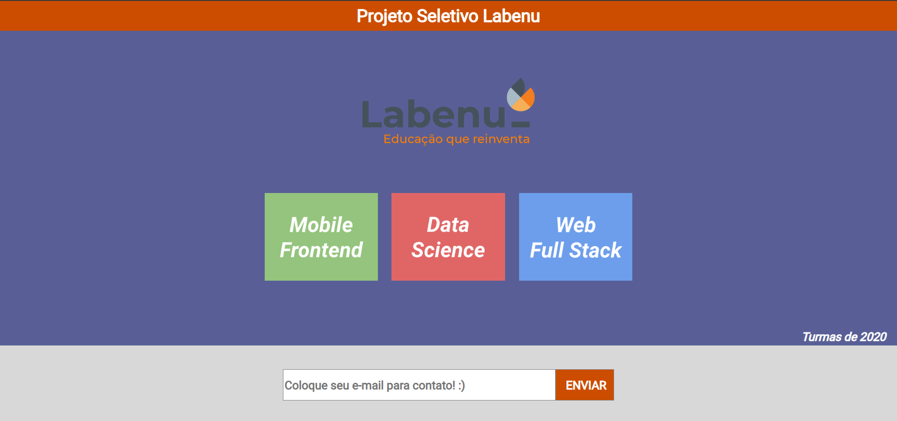
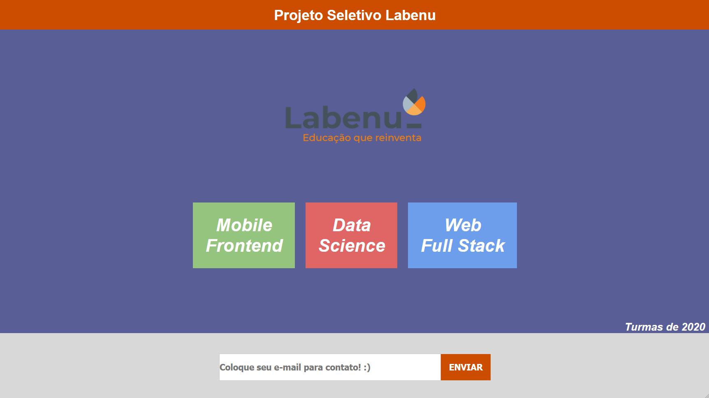

# Processo Seletivo LABENU

Construção de uma página seguindo um wireframe estático, podendo utilizar apenas
HTML, CSS e JS, sem qualquer utilização de bibliotecas externas.

Imagem original 

Resultado atingido 
